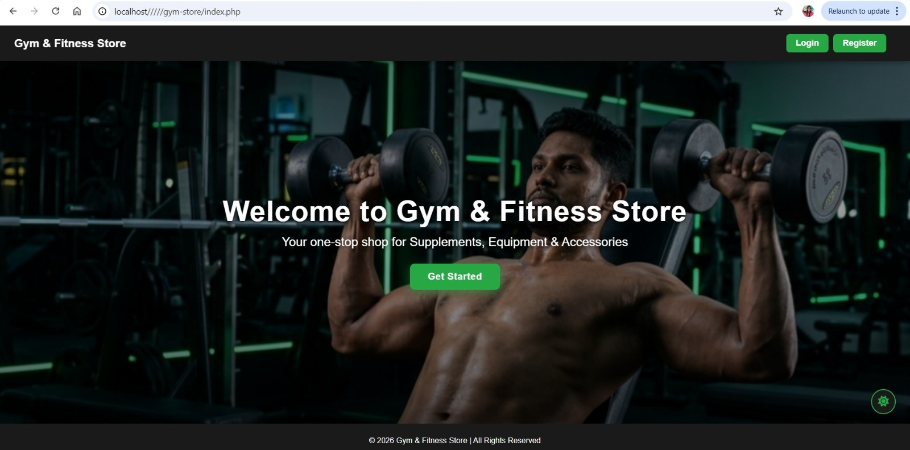
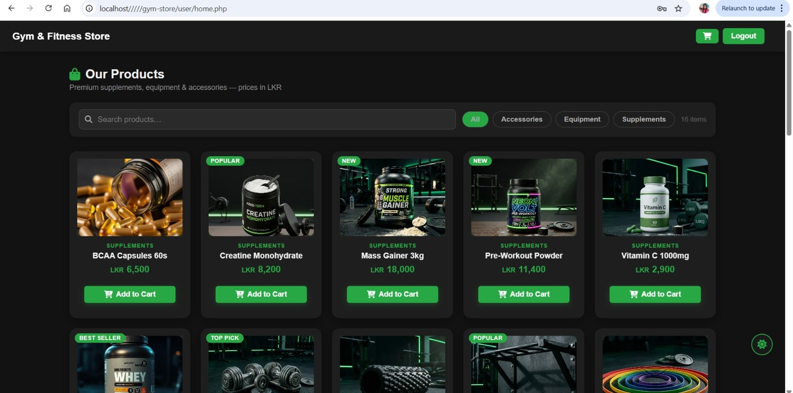
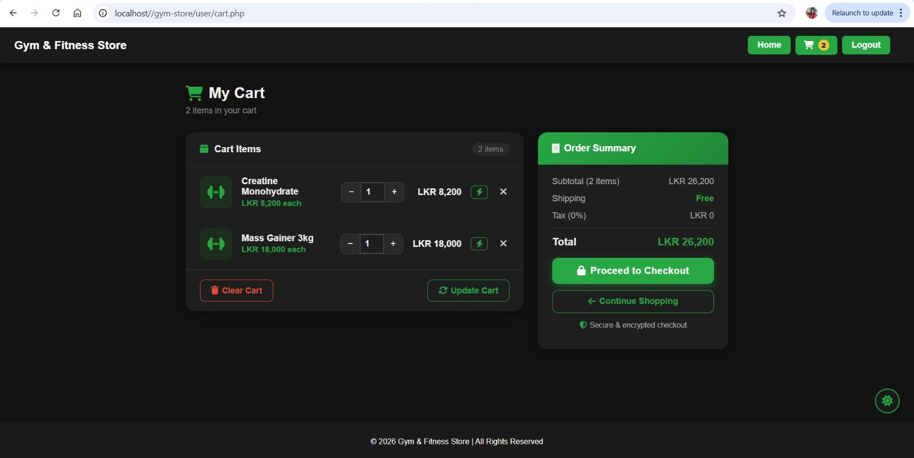
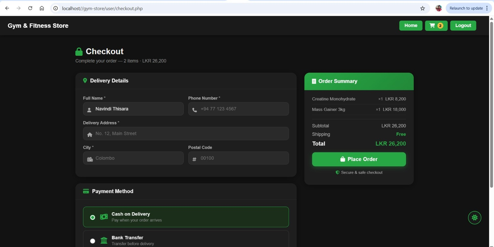
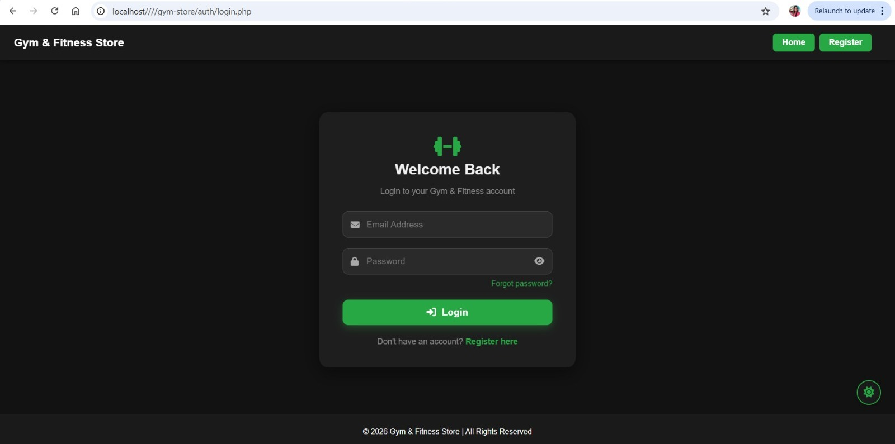
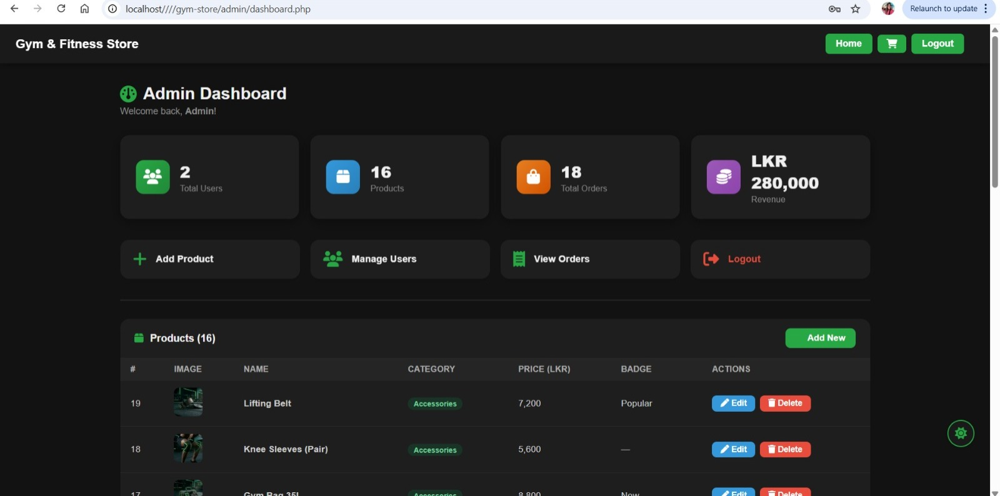

# 🏋️ Gym Store Web Application


A dynamic **E-Commerce Web Application** built using **PHP** and **MySQL** for managing an online gym store.

---

## 📸 Screenshots

### 🏠 Landing Page



### 🛍️ Product Listing



### 🛒 Shopping Cart



### 💳 Checkout Page



### 🔐 Login Page



### 🛠️ Admin Dashboard




---

## 📁 Project Structure

```id="tree1"
htdocs/
├── index.php
├── assets/
│   ├── style.css
│   └── images/
├── config/
│   └── db.php
├── includes/
│   ├── header.php
│   └── footer.php
├── auth/
│   ├── login.php
│   ├── register.php
│   ├── logout.php
│   ├── forgot_password.php
│   └── reset_password.php
├── user/
│   ├── home.php
│   ├── cart.php
│   └── checkout.php
├── database/
│   └── gym_store.sql
├── vendor/
└── admin/
    ├── dashboard.php
    ├── add_product.php
    ├── edit_product.php
    ├── delete_product.php
    ├── users.php
    ├── edit_user.php
    ├── delete_user.php
    └── orders.php
```

---

## 🚀 Features

### 👤 User Side

* User Registration & Login
* Password Reset
* Product Browsing
* Search & Filter
* Cart Management
* Checkout & Payment

### 🛠️ Admin Side

* Dashboard Analytics
* Product Management
* User Management
* Order Management

---

## ⚙️ Setup Instructions

1. Clone the repository
2. Move to `htdocs`
3. Start XAMPP (Apache + MySQL)
4. Import `gym_store.sql`
5. Configure `config/db.php`
6. Run:

```
http://localhost/gym-store
```

---

## 💡 Technologies Used

* PHP
* MySQL
* HTML / CSS / JavaScript
* XAMPP

---

## 👨‍💻 Author

**Navindi Thisara**
Undergraduate | Full Stack Developer

---

## 📄 License

This project is for educational purposes only.
